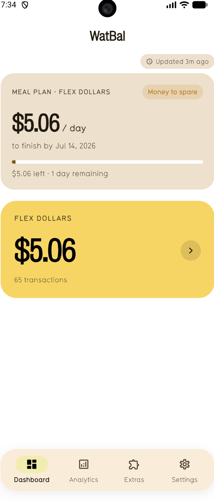
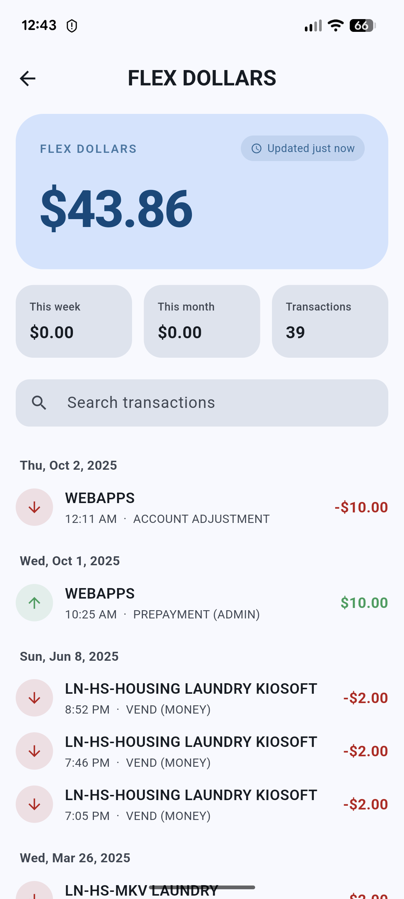
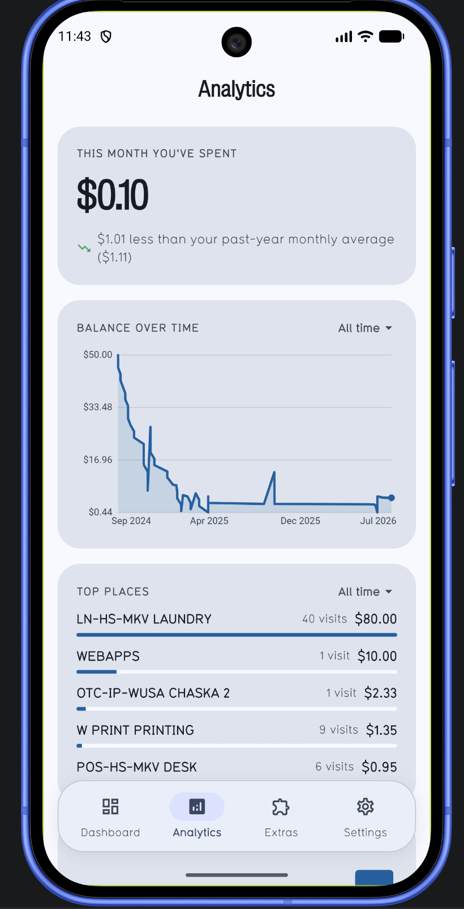

# WatBal

A Flutter app for University of Waterloo students to track meal plan balances and transaction history. Scrapes TouchNet OneWeb and displays account data in-app and on home-screen widgets that refresh in the background.

Android is the primary platform; iOS has native widget and background refresh support but is lower priority.

## Screenshots

<p align="center">
  
  &nbsp;&nbsp;
  
  &nbsp;&nbsp;
  
</p>

## Features

- **Account balances** — scrapes all WatCard accounts (Flex, Meal Plan, etc.) and displays them as tappable hero cards
- **Transaction history** — full history with search, date grouping, and per-account filtering via incremental sync
- **Meal plan pacing** — configurable dashboard showing per-day allowance, spending pace, and an on-track/overspending verdict based on term dates
- **Home-screen widgets** — native widgets on both Android (3 sizes: full with transactions, 2×2 tile, 1×1 tile) and iOS (SwiftUI widget with balance + transactions)
- **Background refresh** — widgets update without opening the app; silently re-authenticates when the session expires
- **Analytics** — balance-over-time chart, top merchants, spending patterns by weekday/time, with configurable time windows
- **Theming** — Light, Dark, Purple, and Gold (UWaterloo brand) themes using Material 3, with UWaterloo brand fonts (Typ1451 + Bureau Grot)
- **Password autofill** — integrates with system credential managers (Google Password Manager on Android, Keychain on iOS)

## Project Structure

```
lib/
  main.dart            # Entry point, themes, lifecycle, WorkManager callback
  auth.dart            # Cookie persistence, silent re-auth, LoginWebView
  scraper.dart         # HTTP scraping (balances + transactions), widget data push
  home_page.dart       # All-accounts menu, account detail, bottom nav, analytics
  loading_page.dart    # Cold-start splash, sign-in flow
  meal_plan.dart       # Meal plan config + pacing computation
  skeletons.dart       # Shimmer loading placeholders
  debug_log.dart       # File logger (works from background isolate)
  log_viewer_page.dart # In-app log viewer

android/               # 3 widget receivers + WorkManager setup
ios/
  Runner/BalanceRefresher.swift   # Native BGAppRefreshTask
  WatBalWidget/                   # SwiftUI widget extension

watbal.py              # Python prototype (reference only, not in build)
```

## Navigation

The app uses a floating bottom nav bar with four tabs:

- **Dashboard** — account hero cards + meal plan pacing card
- **Analytics** — balance chart, top merchants, spending patterns
- **Extras** — meal plan setup, add funds (opens WatCard deposit page), change card PIN
- **Settings** — theme picker, widget account selection, debug logs, re-sync history, sign out

## Dependencies

| Package | Role |
|---------|------|
| `flutter_inappwebview` | Login + silent re-auth WebView |
| `http` | Headless HTTP scraping |
| `html` | HTML parsing |
| `shared_preferences` | Cookie / theme / config persistence |
| `home_widget` | Push data to native widgets |
| `workmanager` | Background refresh scheduling |
| `path_provider` | Debug log file location |

## Getting Started

### Prerequisites

- Flutter SDK ≥ 3.11.5
- Android SDK (for Android builds)
- Xcode (for iOS builds)

### Run

```bash
# Install dependencies
flutter pub get

# Run on connected device / emulator
flutter run

# Run on a specific Android emulator
flutter run -d emulator-5554
```

### Build

```bash
# Android APK
flutter build apk --debug

# iOS (requires Xcode + signing)
flutter build ios
```

### Other Commands

```bash
# Dart analysis
flutter analyze lib/

# Regenerate launcher icons
dart run flutter_launcher_icons
```

## Build Notes

- `android/app/build.gradle.kts` pins `androidx.glance` to 1.1.1 (home_widget pulls an alpha requiring AGP 9 / compileSdk 37)
- Debug signing config is reused for release builds
- AndroidManifest opts out of Impeller (`EnableImpeller=false`) for WebView compatibility on emulators
- KGP deprecation warnings during build are benign
